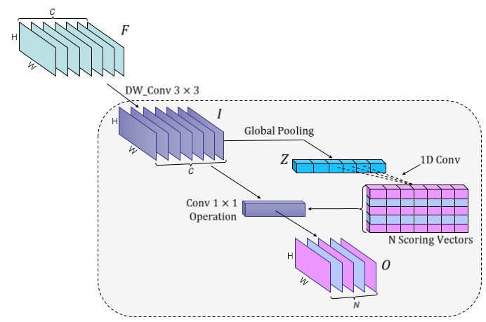
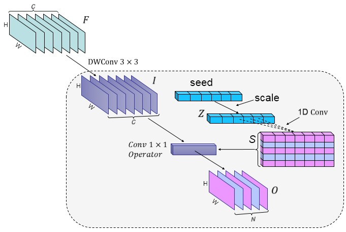

# More compact MobileNet
 The new 1x1 convolution module for greatly reducing the number of parameters of the compact model such as MobileNet.

## General

the initial design architecture:   
　　　　　　　　　　　　　　　　　　　　　　　　　　　　　　　　　　　　　　　　　　　　　　　　　　　　　　　　　　　
    
the modified design architecture:   
　　　　　　　　　　　　　　　　　　　　　　　　　　　　　　　　　　　
   
  
## Required software   

1. pytorch - 0.4
2. python - 3.5

## Hardware required

The code was tested on P100.

 

